# 系统架构总览

这个仓库支撑一个个人健身计划系统，由两条自动化管道组成：

```mermaid
flowchart LR
    subgraph Phone [iPhone]
        HK[Apple Health / HealthKit]
        App[HealthExporter App]
    end
    subgraph Repo [GitHub 仓库: personal-workout-plan]
        Data[health-data/*.json]
        Plan[训练计划内容]
        Workflow[GitHub Actions 定时任务]
    end
    subgraph Cloud [Google 云端]
        GTasks[Google Tasks API]
    end
    GTApp[手机 Google Tasks / Google Calendar]

    HK -->|HealthKit 后台监听| App
    App -->|GitHub Contents API| Data
    Data -->|读取恢复/训练量数据| Plan
    Plan --> Workflow
    Workflow -->|官方 API 写入| GTasks
    GTasks --> GTApp
```

## 两条线

| | Health 数据采集 | 待办自动化 |
|---|---|---|
| 状态 | 已上线（见 [health-export/DESIGN.md](./health-export/DESIGN.md)） | Google Tasks 方案验证中（见 [reminders-sync/PLAN.md](./reminders-sync/PLAN.md)），iCloud CalDAV 方案已放弃 |
| 运行位置 | 用户 iPhone 本地 App | GitHub Actions（云端定时任务） |
| 数据流向 | Health → 仓库 | 仓库 → Google Tasks → 手机 |
| 认证方式 | GitHub Fine-grained PAT（存 iOS Keychain） | Google OAuth refresh token（存 GitHub Actions Secrets） |

## 分支结构说明

这个仓库目前有两个分支：`main` 和 `claude/personalized-fitness-plan-tw4ucb`。

**这不是一开始就设计好的**，是过程中出于两个约束叠加产生的：
1. 这次协作 session 被要求把所有开发提交到 `claude/personalized-fitness-plan-tw4ucb` 这个指定分支上
2. 手机上的 HealthExporter App 硬编码写入 `main` 分支（因为它需要一个"稳定不变"的分支持续追加每日数据文件），而当时仓库是全新的，没有任何分支存在，只能现建一个 `main`

结果是：`main` 分支现在被手机每天自动追加 `health-data/*.json`（截至写这份文档时已经领先好几个 commit），而 `claude/personalized-fitness-plan-tw4ucb` 只包含这次 session 手动推送的代码改动，两边会持续分叉。

**后续建议**：把 `claude/personalized-fitness-plan-tw4ucb` 的内容合并进 `main`，之后把 `main` 当作唯一的"生产分支"——手机继续往这里写数据，Reminders 的 GitHub Actions 也跑在这个分支上，这次 session 的分支之后可以直接废弃。这一步涉及分支合并，需要你明确同意后我才会操作。

## 已知限制

- **HealthKit 后台同步是"尽力而为"**：iOS 不保证精确的每小时触发，实际间隔可能从几十分钟到几小时不等；如果用户从多任务列表里强制划掉 App，后台权限会被暂停，需要重新手动打开一次才能恢复
- **免费 Apple ID 签名 7 天过期**：App 需要每 7 天重新用 Xcode 连接一次手机刷新签名，否则打不开（不会被卸载）
- **本地存储的 Git 历史即数据历史**：`health-data/` 下每天一个文件，没有额外数据库，`git log` 本身就是历史记录
