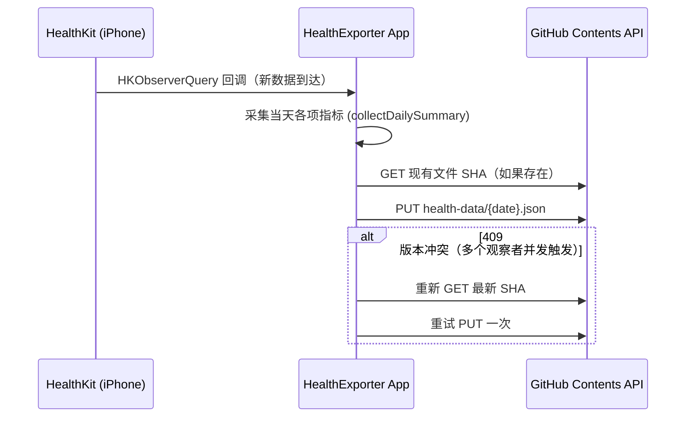

# Health 数据采集 — 设计文档

状态：**已上线**（App 已装机测试，端到端链路跑通）
配套文档：[../../health-export-app/README_SETUP.md](../../health-export-app/README_SETUP.md)（搭建步骤）

## 目标

每天自动把 Apple Health 里跟训练强度、恢复状态相关的数据，落地到这个仓库，供后续制定/调整训练计划时参考，不需要用户手动截图或者口头汇报数据。

## 为什么自建 App，而不是用现成工具（如 Health Auto Export）

| | 自建 HealthKit App | Health Auto Export（第三方） |
|---|---|---|
| 费用 | 免费（只要 Apple Developer 免费账号） | 一次性/订阅付费 |
| 字段自定义 | 完全自定义 | 受限于该 App 提供的选项 |
| 数据落地位置 | 可以直接 Push 到我们自己的仓库 | 需要额外配置 Google Sheets/Notion 等中间存储 |
| 维护成本 | 需要自己写 Swift 代码、免费签名每 7 天要重装一次 | 免维护，官方更新 |

选择自建，主要是因为可以让数据**直接落进这个仓库**，不需要 Google Sheets 这类中间层，跟仓库里其他自动化（训练计划、Reminders）在同一个数据源上，减少一层依赖。

## 为什么用这个仓库（Git）当存储，而不是 Google Sheets / Notion / 数据库

- 不需要额外的 connector/服务账号，本身就在这个仓库里
- `git log` 天然就是历史记录，不需要额外的时间序列存储
- 免费，跟仓库里其他内容（训练计划、以后的 Reminders 自动化脚本）统一管理

## 采集字段与取舍

| 字段 | HealthKit 标识 | 用途 |
|---|---|---|
| 训练记录 | `HKWorkoutType` | 追踪实际训练量、类型、强度 |
| 睡眠时长与阶段 | `HKCategoryTypeIdentifierSleepAnalysis` | 恢复状态，决定当天训练强度 |
| 静息心率 | `HKQuantityTypeIdentifierRestingHeartRate` | 恢复/疲劳信号 |
| HRV | `HKQuantityTypeIdentifierHeartRateVariabilitySDNN` | 比静息心率更灵敏的恢复指标 |
| 步数 | `HKQuantityTypeIdentifierStepCount` | 日常活动量，辅助热量缺口/盈余判断 |
| 静息能量消耗 | `HKQuantityTypeIdentifierBasalEnergyBurned` | 基础代谢参考 |
| 活动能量消耗 | `HKQuantityTypeIdentifierActiveEnergyBurned` | 训练外的额外消耗 |
| 活动圈数据 | `HKActivitySummaryType` | 移动/锻炼/站立三环概览 |

**体重不采集**：iPhone/Watch 无法自动测量体重，与其接入第三方体脂秤增加复杂度，不如后续由训练计划直接询问用户，更简单可靠。

## 架构

## 已知问题与修复记录

1. **StateObject 在 App.init() 里访问的警告**：曾经把后台观察者注册逻辑放在 `HealthExporterApp.init()` 里，通过 `@StateObject` 访问对象，SwiftUI 报"对象未安装到 View 就被访问，可能创建出多余实例"的警告。修复：改为在 `ContentView.onAppear` 里注册，确保用的是被正确安装、且被 `environmentObject` 共享的唯一实例。
2. **多个 HKObserverQuery 并发写入同一文件导致 409**：8 种数据类型各自独立监听，健康数据经常成批更新，导致多个回调几乎同时触发 `syncToday()`，都尝试 PUT 同一个每日文件，先到的成功、后到的因为 SHA 过期被拒绝。修复：加了 `isSyncing`/`syncQueued` 简单的进程内互斥锁，同一时间只跑一个同步，其余触发排队补跑一次；`GitHubUploader` 也加了 409 时自动重新拿 SHA 重试一次的逻辑。
