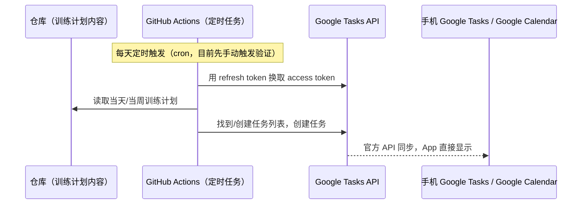

# Reminders/待办自动化 — 设计与规划文档

状态：**已放弃 iCloud CalDAV 方案，改用 Google Tasks，Google Tasks 这条线已验证可行**

## 目标

把训练计划自动写入一个支持打勾完成、带 widget 的待办工具，不需要用户手动录入。

## 第一次尝试：iCloud CalDAV（已放弃）

最初选择 iCloud CalDAV，是因为它不需要用户装任何新 App，直接写入原生 Reminders。这条路完整走了一遍：搭好脚本、GitHub Actions、iCloud App 专用密码认证，写入本身没有报错，服务器端也确认存住了数据（通过 CalDAV 协议本身读回来验证过），但 Reminders App（手机端和 `icloud.com/reminders` 网页版）**始终不显示这些数据**，即便：

- 排除了"选错列表"（日历 vs 提醒事项列表同名混淆）的问题
- 排除了新建列表需要时间同步到 CalDAV 的可能
- 排除了 iCloud 存储空间不足导致同步卡住的可能（升级 iCloud+ 后问题依旧）
- 排除了 DUE 字段格式的问题（带/不带截止时间的测试待办都不显示）

### 根本原因（已查证）

**iOS 13（2019 年）开始，苹果把 Reminders 的同步机制从标准 CalDAV 协议，整体迁移到了私有的 CloudKit 后端。** `caldav.icloud.com` 这个接口依然开着、依然接受第三方工具写入 VTODO 数据（这就是为什么写入不报错、服务器端计数也在涨），但这些数据进的是一个**遗留兼容层**，现代的 Reminders 客户端（iOS App、网页版）根本不读这个仓库，所以永远不会显示。这不是我们代码或配置的问题，是苹果在协议层面主动切断了这条路。

参考来源：
- [Where Did My Reminders Go After Upgrade? (No CalDAV Support) | BusyCal & BusyContacts](https://www.busymac.com/docs/faqs/112990-reminders-in-ios-13-and-macos-catalina-drops-support-for-caldav/)
- [CalDAV imports "calendars" which are reminders lists in iCloud, and not all calendars are loaded · Issue #86221 · home-assistant/core](https://github.com/home-assistant/core/issues/86221)
- [Access to Reminders after iOS13 - Apple Developer Forums](https://developer.apple.com/forums/thread/129740)

### 教训

调试这个问题花了很长时间，绕了一大圈（选错列表、DUE 格式、存储空间、发现延迟……），最后才发现是平台层面的已知限制。**以后接入"标准协议 + 大平台官方服务"这类组合时，动手写代码/开始调试前，应该先花几分钟搜一下该平台对这个协议的支持现状/已知限制**，而不是遇到诡异现象后才一步步排查、猜测。这条经验记录在这里，后续同类工作应遵循。

`scripts/reminders_sync.py` 和 `.github/workflows/reminders-sync.yml` 这两个文件已删除（调试过程的代码不再保留，完整过程见本文档和 git 历史）。

## 第二次尝试：Google Tasks（当前方案，已验证可行）

### 为什么选它

Google Tasks 有官方维护的 REST API，不是协议层的灰色地带，原生支持打勾完成，iOS 有官方 widget，如果本来就用 Google Calendar 的话几乎不算"装新 App"。

### 架构

### 认证与凭证管理

- Google Cloud 项目 + OAuth 同意屏幕（External 用户类型，个人 Gmail 账号）
- 一次性本地运行 `scripts/google_tasks_auth.py` 走 OAuth 授权流程，拿到 refresh token
- 存放在 **GitHub Actions Secrets**：`GOOGLE_CLIENT_ID`、`GOOGLE_CLIENT_SECRET`、`GOOGLE_REFRESH_TOKEN`
- 目前 OAuth 应用处于"测试"状态；Google Tasks 的 scope 未被列为敏感/受限类别，个人使用是否会触发 7 天 refresh token 过期，需要实际观察确认（如果触发，可以后续提交 Google 验证/发布流程解决，可以边用边等审核，不冲突）

### 现状

- `scripts/google_tasks_sync.py` 已实现：读取 access token → 按精确名字查找/创建任务列表 → 创建测试任务 → 回读确认
- `.github/workflows/google-tasks-sync.yml` 已实现，支持 `workflow_dispatch` 手动触发，可通过 `list_name` 输入覆盖默认任务列表名字，方便调试
- 待验证：手机 Google Tasks / Google Calendar 上能否正常看到测试任务（Reminders 那次的教训——写入成功不代表客户端真的能看到，需要端到端验证完整闭环）

## 待实现步骤（Google Tasks 路线）

1. ~~搭建 Google Cloud 项目、OAuth 同意屏幕、Tasks API scope~~ 已完成
2. ~~本地走一次 OAuth 授权，拿到 refresh token，存进 GitHub Actions Secrets~~ 已完成
3. ~~写同步脚本 + workflow~~ 已完成
4. **端到端验证**：手动触发 workflow，确认手机上真的能看到任务（进行中）
5. 训练计划的具体内容来源——依赖训练计划本身的数据结构，目前还没定义（目标/器械/身体水平那次访谈还没做），可以先用占位数据跑通技术链路
6. 决定这个 workflow 跑在哪个分支（建议 `main`，见 [../ARCHITECTURE.md](../ARCHITECTURE.md)）
7. 观察 Google OAuth refresh token 在"测试"状态下的实际有效期，如遇 7 天过期，评估是否提交验证/发布流程

## 未决问题

- [ ] 训练计划本身的内容和数据结构还没定义
- [ ] Google OAuth 应用要不要走完整验证发布流程（取决于 7 天过期是否真的触发）
- [ ] 任务被勾选完成后，要不要反向同步回仓库——加分项，非本阶段必需
