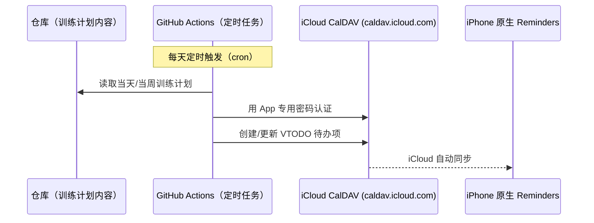

# Reminders 自动化 — 设计与规划文档

状态：**规划中，尚未实现**

## 目标

把训练计划自动写入用户 iPhone 原生 Reminders（不装新 App），带日期、可勾选完成，主屏 widget 直接可见。

## 为什么选 iCloud CalDAV

| 方案 | 是否需要新装 App | 是否原生 Reminders/widget | 认证方式 |
|---|---|---|---|
| **iCloud CalDAV（选定）** | 否 | 是 | Apple ID App 专用密码 |
| Google Tasks | 是（心理成本，非技术成本） | 否（Google 自己的 widget） | OAuth |
| Shortcuts + Pushcut 触发 | 是（Pushcut） | 是 | Webhook + 第三方 App |

CalDAV 是苹果日历/提醒事项底层就在用的开放协议，iCloud 服务器本身支持第三方客户端接入（Thunderbird、BusyCal 等多年来都是这么做的），不需要用户装任何新 App，数据直接落在原生 Reminders 里。

## 架构

## 认证与凭证管理

- 用户在 appleid.apple.com 生成一个 **App 专用密码**（不是 Apple ID 主密码）
- 存放在 **GitHub Actions Secrets**（仓库级别，加密存储，workflow 运行时才注入，不出现在日志/代码里）
- 需要的 Secrets：`APPLE_ID`（Apple ID 邮箱）、`APPLE_APP_PASSWORD`（专用密码）

## 待实现步骤

1. 用户生成 Apple 专用密码（用户操作）
2. 写 Python 脚本（用 `caldav` 库）：连接 `caldav.icloud.com` → 找到/创建一个 Reminders 列表 → 创建带日期的 VTODO 待办项
3. 先跑通"写一条测试提醒事项"验证链路（脚本可以本地/CI 手动触发一次测试）
4. 包装成 GitHub Actions workflow（`.github/workflows/`），定时触发（比如每天早上）
5. workflow 里读取训练计划的具体内容来源——**这一步依赖训练计划本身的数据结构，目前还没定义**（训练计划的目标/器械/身体水平这条线尚未开始，见下方"未决问题"）
6. 决定这个 workflow 跑在哪个分支（建议 `main`，见 [../ARCHITECTURE.md](../ARCHITECTURE.md) 里的分支结构说明）

## 未决问题

- [ ] 训练计划本身的内容和数据结构还没定义（目标、器械、身体水平访谈还没做）——Reminders 自动化最终要读这份数据，但可以先用占位/测试数据跑通 CalDAV 链路，两条线可以并行推进
- [ ] Reminders 列表命名/是否需要区分"训练提醒"和其他现有的 Reminders 列表
- [ ] 待办项被用户勾选完成后，要不要反向同步回仓库（记录"实际完成了哪几天"）——这属于加分项，不是这一阶段的必需功能
